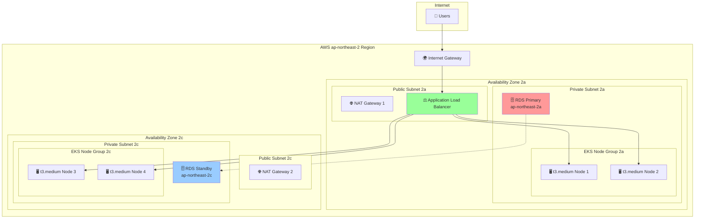
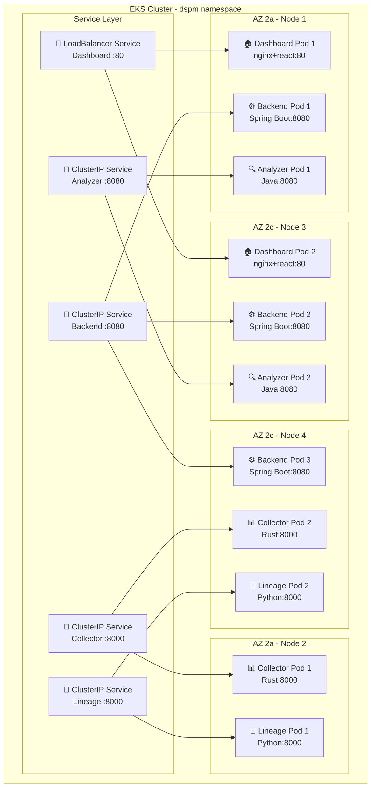

# DSPM 플랫폼 이중화 아키텍처 다이어그램

## 🏗️ High-Level 이중화 아키텍처



## 🔄 Kubernetes 클러스터 내부 Pod 배치



## 📊 이중화 상태 현황표

| 구성요소 | 현재 상태 | 이중화 목표 | 이중화 레벨 |
|---------|----------|------------|------------|
| 🌐 **네트워크** | Single NAT | Dual NAT (Multi-AZ) | ⭐⭐⭐ |
| 🗄️ **데이터베이스** | Single AZ | Multi-AZ RDS | ⭐⭐⭐ |
| 🖥️ **컴퓨팅** | 2 Nodes | 4 Nodes (2 per AZ) | ⭐⭐⭐ |
| 🏠 **Frontend** | 1 replica | 2 replicas | ⭐⭐ |
| ⚙️ **Backend** | 1 replica | 3 replicas | ⭐⭐⭐ |
| 🔍 **Analyzer** | 1 replica | 2 replicas | ⭐⭐ |
| 📊 **Collector** | 1 replica | 2 replicas | ⭐⭐ |
| 🔗 **Lineage** | 1 replica | 2 replicas | ⭐⭐ |

**이중화 레벨:**
- ⭐ = 기본 (Single Point)
- ⭐⭐ = 부분 이중화 (2개 복제본)
- ⭐⭐⭐ = 완전 이중화 (3개+ 복제본, Multi-AZ)

## 🚀 이중화 구현 로드맵

### Phase 1: 인프라 이중화 (우선순위: 높음)
```yaml
# CDK 변경사항
vpc = ec2.Vpc(
    self, "DspmVpc",
    max_azs=2,
    nat_gateways=2  # ✅ 이중화
)

database = rds.DatabaseInstance(
    # ... 기존 설정
    multi_az=True  # ✅ 이중화
)
```

### Phase 2: 애플리케이션 이중화 (우선순위: 중간)
```yaml
# Backend 3개 replicas + Anti-Affinity
replicas: 3
affinity:
  podAntiAffinity:
    requiredDuringSchedulingIgnoredDuringExecution:
    - topologyKey: kubernetes.io/hostname
```

### Phase 3: 모니터링 및 자동복구 (우선순위: 중간)
- Health Check 강화
- Auto Scaling 설정
- 장애 감지 및 알림

## 📈 이중화 효과 지표

| 지표 | 현재 | 목표 | 개선률 |
|-----|------|------|--------|
| **가용성** | 99.5% | 99.9% | ⬆️ 0.4% |
| **복구시간** | 5-10분 | 1-2분 | ⬇️ 80% |
| **동시장애 허용** | 0개 | 1-2개 | ⬆️ 200% |
| **데이터 손실** | 위험 | 최소화 | ⬇️ 95% |

이 구성을 통해 **단일 장애점 없는 고가용성 DSPM 플랫폼**을 구축할 수 있습니다! 🎯